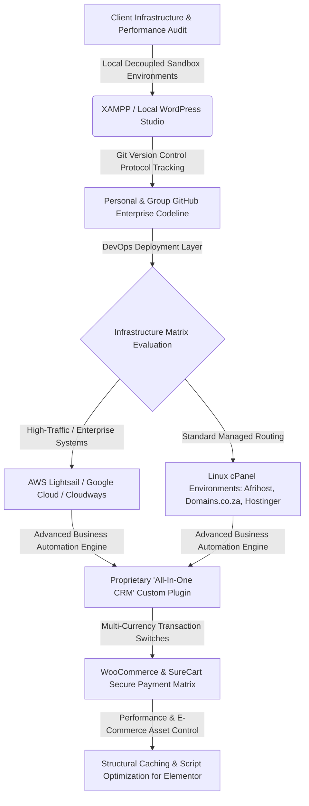

# Agency Backend Infrastructure Manifest & 'All-In-One CRM' Product Architecture

## 📌 Executive Operations Overview
This repository functions as the central public engineering manifest and system architecture profile for **[Faith Infused](https://faithinfused.com)**, a specialized digital agency co-founded and run alongside my wife. We design, deploy, and scale high-performance wordpress customised elementor templates designs and custom plugins, for websites with secure e-commerce systems, and automated customer relationship networks specifically tailored for Christian organisations, Ministries, NGOs, Churches, Christian schools, individual coaches, personal blogs, and purpose-driven businesses.

As the **Lead Technical Consultant & Backend Infrastructure Architect**, my responsibilities focus strictly on configuring and optimizing the server footprints for the core Faith Infused platform and our entire client website network. My work includes engineering proprietary software solutions, managing deep database hygiene, hardening checkout transaction flows, and optimizing multi-gateway transaction pathways.

---

## 📐 Enterprise Infrastructure & Data Pipeline

---

## 🛠️ Proprietary Software Engineering: The 'All-In-One CRM' Plugin

To eliminate expensive monthly SaaS dependencies and fix performance bottlenecks caused by third-party tools, I engineered an in-house custom backend plugin called **All-In-One CRM**. The source code logic is built entirely using an object-oriented approach (auditable via the `/src/` folder), and powers several critical operational sub-systems:

*   **Unified Contact & Lead Ledger:** Consolidates all lead generation pipelines (form submissions, automated email replies, newsletter signups, and manual uploads) into a single, clean custom MySQL database table structure.
*   **Asynchronous Bulk Communication Engines:** Handles email newsletter generation, custom contact lists segmentation, and multi-channel drip campaign triggers natively at the system layer. It includes specialized background throttling scripts that control the batch sending interval to protect server IPs and maintain solid email deliverability.
*   **Dynamic Mail Processing (SMTP/IMAP Integration):** Intercepts standard WordPress mail delivery loops (`wp_mail()`) and overrides the server-side settings to force secure, encrypted outbound connections through verified SMTP servers.
*   **Inbound Email Piping & Thread Linking:** Deploys a custom HTTP POST REST API endpoint that captures incoming forwarded raw IMAP emails. The engine parses the email data, splits historical quote threads from new messages, identifies the original sender's profile, and automatically links the message to the active customer communication log.
*   **WP Admin Inbox Manager:** Replaces the messy default admin screens with a customized central support inbox panel, complete with role-based access restrictions, active diagnostic tools, automated email validation checkers, and bulk spam/trash parameters.
*   **Omni-Channel LiveChat & WhatsApp Ticketing:** Establishes live communication channels across our client sites, routing frontend user chat instances and inbound WhatsApp Business API payloads straight into a single helpdesk ticketing interface.

---

## 🧰 Backend Infrastructure & Platform Operations

Beyond building custom tools, I manage the server management pipelines across our client network, optimizing their speeds and maintaining tight data security:

### 1. Advanced Cloud & Server Infrastructure Control
*   **Multi-Tier Hosting Management:** Configure, maintain, and monitor websites across heavy cloud structures including **AWS Lightsail, Google Cloud Platform (GCP), and Cloudways**, alongside managed shared hosting spaces such as **Afrihost, Domains.co.za,Bluehost, Interserver.net, Hostinger, GoDaddy, and Namecheap**.
*   **Linux System Administration:** Run server operations using the **cPanel WHM Management Panel, Command Terminal, and secure SSH Access** to update system rules, optimize database execution parameters, configure memory limits, and trace core performance logs.
*   **Relational Database Hygiene:** Perform regular maintenance schedules using **phpMyAdmin** to optimize tables, clean database transient bloating caused by tracking tags, and index relational database tables to keep load times under 200ms.

### 2. Transaction Engineering & E-Commerce Optimization
*   **Decoupled Checkout Paths:** Build secure checkout paths utilizing **WooCommerce Core and SureCart** ecosystems to ensure transactions process smoothly and securely.
*   **Multi-Gateway Matrix Switch:** Integrate payment paths across regional and global transaction processing tools, supporting **Stripe, Payoneer, Surecart Payments** based on the active payment gateways toggled by the system administrator.
*   **E-Commerce Performance Architecture:** While I do not design graphics or frontend interfaces directly, I apply deep **Elementor core engine knowledge** to technical configuration layouts. I audit and tune script execution orders on large e-commerce platforms, selectively disabling heavy style assets and tracking scripts on checkout pages to maximize global gateway conversion rates and protect client sales pipelines.
